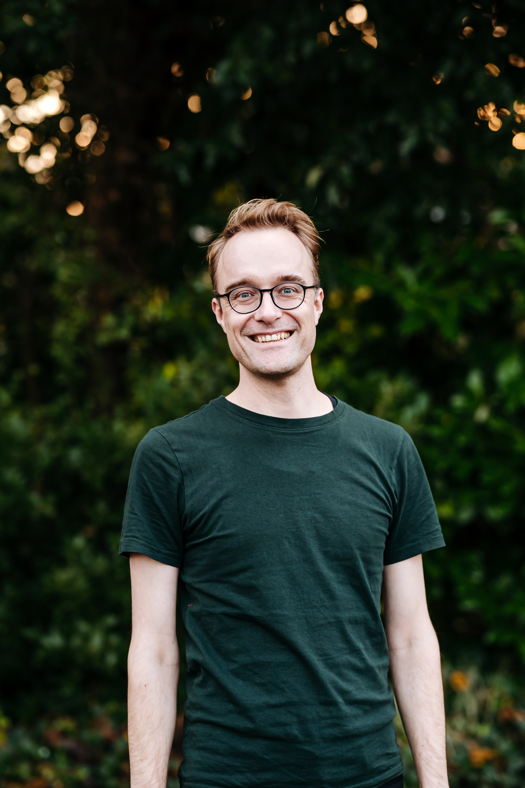
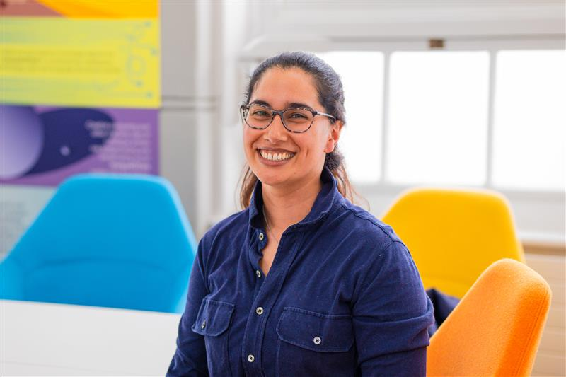
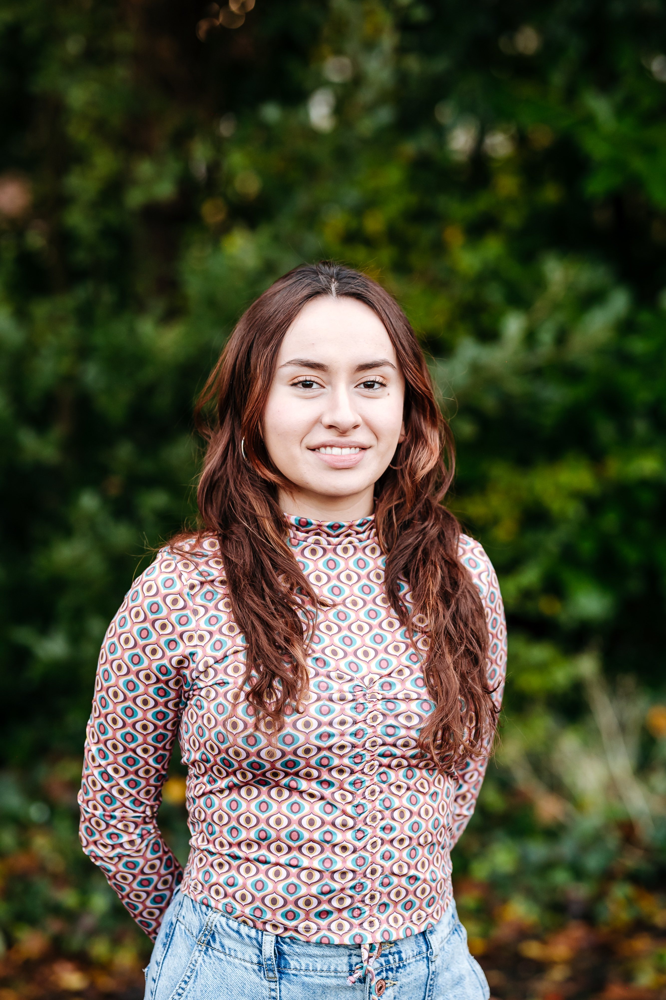

## Meet Our Contributors

  
  

    <strong>Professor James Baker</strong> is the Director of Digital Humanities at the University of Southampton and Academic Lead of Digital Preservation Southampton. A historian by training, he works at the intersection of history, cultural heritage, and digital technologies. James is a Software Sustainability Institute Fellow, a Trustee of the Programming Historian, and a founding member of the Digital Humanities Climate Coalition.
  

  
  

    <strong>Dr. Ammandeep K Mahal</strong> is the Business Lead of Digital Preservation Southampton. In her role, she works to support DPS' connection to the wider University of Southampton and supports partnerships with our partners. She holds over ten years of experience in the cultural heritage sector and her background is in Maritime Archaeology.
  

  
  

    <strong>Laurisa Sastoque</strong> is the Digital Preservation Training Officer at Digital Preservation Southampton. In her role, she works to develop training and strategic guidance to inform partnerships in the digital cultural heritage sector. Her background is in Digital Humanities and History.
  

