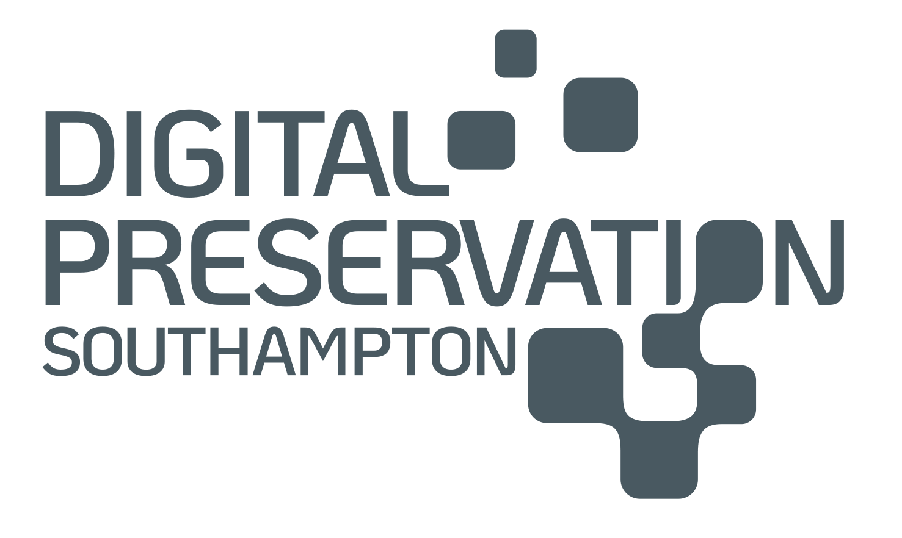
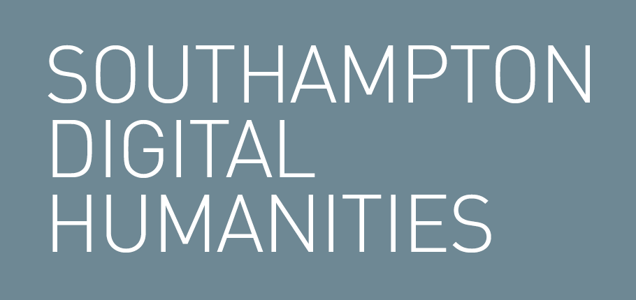

<!---

--->

  

Welcome to the newest blog platform for [Southampton Digital Humanities](https://www.southampton.ac.uk/research/institutes-centres/digital-humanities) and [Digital Preservation Southampton](https://www.southampton.ac.uk/research/institutes-centres/digital-preservation-southampton). On here, we will be posting a series of pieces that reflect our interests and commitments to digital cultural heritage and the digital humanities, and the sorts of issues and challenges that we are thinking about. We hope this provides an incentive for discussion and contributes to the dissemination of our work in the sector.

Enjoy the read!
